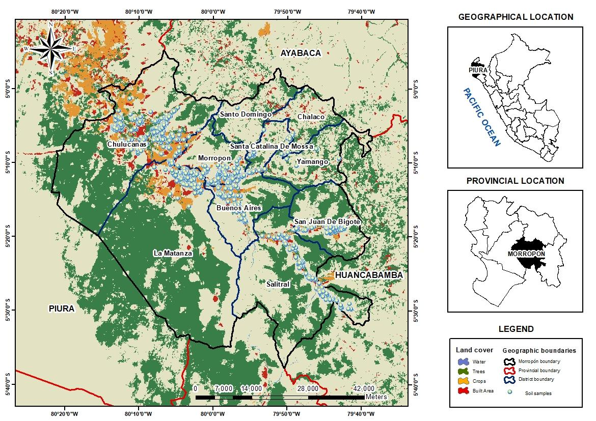
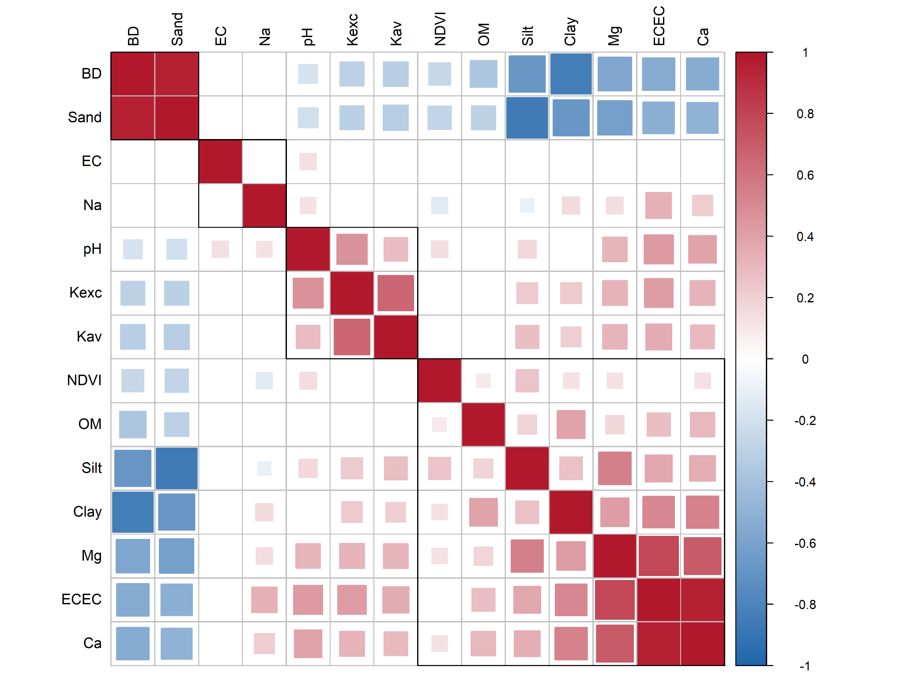
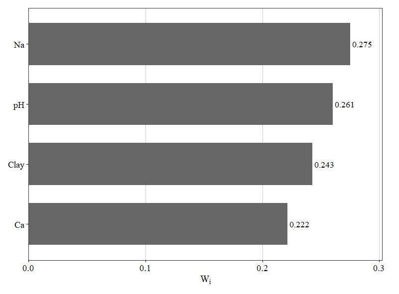
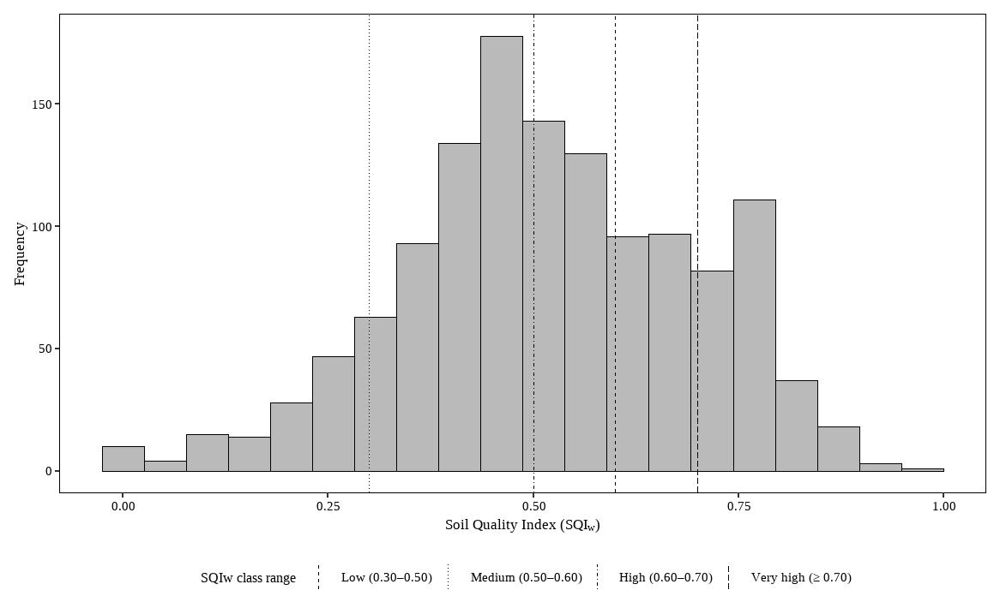
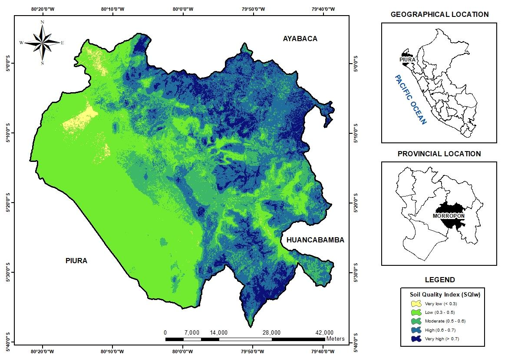

---

**Hybrid machine learning–geostatistical modelling of soil quality in saline, sodic and alkaline soils under arid agroecosystems**

Sebastian Casas-Niño^1^, Sharon Mejía, Ruth Mercado, Extensionista, Laboratorio,  Kenyi Quispe^2\*^

*^1^ Dirección de Servicios Estratégicos Agrarios - Estación Experimental Agraria El Chira, Instituto Nacional de Innovación Agraria (INIA), Piura 20120, Perú.*

* ^\*^ *Corresponding author: investigación\_labsaf@inia.gob.pe

**Highlights**

* 

**Declarations**

**Funding**

This work was funded by the National Institute of Agricultural Innovation (INIA), Peru, through investment project No. 2472190 'El Chira'.

**Conflict of Interest**

The authors declare no conflicts of interest.

**Author Contributions**	

Conceptualization, XX., XX, and XX.; methodology, XX.; formal analysis, .; investigation,; data curation, ; writing—original draft preparation, ; writing—review and editing, ; visualization,. All authors have read and agreed to the published version of the manuscript.

**Data availability**

The original contributions presented in this study are included in the article and supplementary material. Reproducible datasets and data analysis are available in Supplementary File 1 and can be accessed via the GitHub repository at: 

**ABSTRACT**

Soil fertility management in irrigated mango and banana cropping systems in northern Peru is hampered by strong spatial heterogeneity associated with soil chemical constraints and landscape-scale processes. The objective of this study was to develop a spatial predictive framework to assess soil quality and support site-specific management decisions in the Piura region of Peru. A soil quality index (SQIw) was developed to diagnose the main edaphic constraints related to nutrient availability and soil chemical imbalance. Spatial prediction of the SQIw was performed using a hybrid modeling approach combining Random Forest (RF) machine learning with RF residual regression kriging, using environmental covariates derived from terrain attributes, climate variables, and vegetation indices. Model performance was evaluated using an independent validation test and cross-validation strategies tailored to each modeling component. The RF model alone showed moderate predictive performance (R² ≈ 0.21; RMSE ≈ 0.16), indicating limited explanatory power of the covariates. In contrast, the regression kriging model improved prediction accuracy, reducing the RMSE (RMSE ≈ 0.08; MAE ≈ 0.06) and increasing the coefficient of determination to R² ≈ 0.83. The hybrid model also demonstrated superior extrapolation capability in unsampled locations. The resulting soil quality map allows for the delineation of fertility management zones and supports the selective application of fertilizers and agricultural gypsum. Overall, the proposed methodology provides an important and transferable tool for soil management in mango and banana production systems under arid and semi-arid conditions.

**Keywords:** Soil quality index; Regression kriging; Random Forest; Digital soil mapping; Precision agriculture.

# **INTRODUCTION**

Agricultural activity constitutes a structural pillar of the economy of the Piura region, contributing approximately 9–10% of regional gross domestic product and accounting for some 27–29% of formal employment, which underscores its economic and social importance on the northern Peruvian coast (INEI, 2024). At the provincial scale, Morropón—together with Sullana and Piura—forms a strategic fruit-production nucleus, with mango predominantly cultivated in the San Lorenzo Valley (districts of Las Lomas, Tambogrande and Chulucanas) and banana production concentrated in the Chira Valley [(Ministerio de Desarrollo Agrario y Riego, 2025)](https://www.zotero.org/google-docs/?9FyrNi). In this context, mango is the third most important crop in the region, representing roughly 7.1% of regional agricultural output in 2024, and Piura concentrates about 70% of national mango production [(Ministerio de Desarrollo Agrario y Riego, 2025)](https://www.zotero.org/google-docs/?0ygo8M). During the 2024/2025 season, the region produced approximately 415,000 t of mango, reflecting a recovery following impacts associated with the El Niño event of 2023, and recorded exports of about 259,900 t of fresh fruit [(PROMPERÚ, 2024)](https://www.zotero.org/google-docs/?6ytiyN). Banana—largely produced under organic systems—contributes roughly 5.7% of the regional agricultural value, making Piura the second largest producing region nationally with an estimated 14.4% share [(Ministerio de Desarrollo Agrario y Riego, 2025)](https://www.zotero.org/google-docs/?Oo8F5s). Together, these crops drive regional agri-exports, underpin extensive rural value chains, generate seasonal and permanent employment, and represent a critical source of income and food security for the arid agroecosystems of Morropón and the wider Piura region [(Instituto Nacional de Estadística e Informática (INEI), 2024; Ministerio de Desarrollo Agrario y Riego, 2025)](https://www.zotero.org/google-docs/?ATBGUJ).

The productive sustainability of these fruit systems is tightly linked to soil quality because both mango and banana have marked edaphic and nutritional requirements. Both crops favour deep, well-drained soils with substantial moisture-holding capacity, preferably of silty-loam texture and enriched with organic matter to sustain vigorous vegetative growth and stable yields [(Galán Saúco, 2020)](https://www.zotero.org/google-docs/?YrXtOi). Optimal soil pH is close to neutral: 6.0–7.0 for mango and 5.5–6.6 for banana, with strongly acidic or alkaline conditions restricting nutrient availability and predisposing to nutritional disorders [(Navamani, 2025)](https://www.zotero.org/google-docs/?ngnxnA). Nutritionally, the crops demand substantial macronutrient inputs; bananas are particularly demanding in nitrogen and potassium, with typical annual recommendations in the range of 200–400 kg N ha⁻¹, 45–60 kg P₂O₅ ha⁻¹, and 240–480 kg K₂O ha⁻¹ depending on the production system and target yields [(Villaseñor-Ortiz et al., 2022)](https://www.zotero.org/google-docs/?07Q9Q6). Mango also removes appreciable quantities of nutrients—an output of c. 15 t ha⁻¹ may extract 100 kg N, 25 kg P₂O₅, and 110 kg K₂O—and requires adequate supplies of calcium, magnesium, and sulfur to secure fruit quality [(Mellado-Vázquez et al., 2019)](https://www.zotero.org/google-docs/?PBLjGb). Recommended edaphic reference values for mango include Ca concentrations ≥ 200 ppm, a (Ca + Mg): K ratio of about 2.5–5:1, K levels of 80–120 ppm and available P > 20 ppm [(Galán Saúco, 2020)](https://www.zotero.org/google-docs/?7Ocg1f).

These requirements are exacerbated in Piura’s arid agroecosystems by strong spatial heterogeneity of soil properties and by the frequent occurrence of salinity and sodicity. Both crops are sensitive to salinity: banana is particularly intolerant, with critical thresholds for the electrical conductivity of the saturation extract typically below 1 dS m⁻¹, above which marked reductions in growth and yield are observed [(Almeida et al., 2016; Gul et al., 2025)](https://www.zotero.org/google-docs/?ukNxoZ). Mango likewise exhibits reduced vegetative development and productivity under elevated soil or irrigation-water salinity. In such contexts, conventional uniform fertilizer application across edaphically heterogeneous fields commonly produces agronomic and environmental inefficiencies: over-fertilized zones are prone to nutrient leaching and contamination, whereas under-fertilized areas limit yield potential and accelerate soil degradation [(Poma-Chamana et al., 2025)](https://www.zotero.org/google-docs/?QW3fsk).

The mounting evidence of soil degradation and loss of functional capacity has driven the development of integrated soil quality indices (SQI), designed to synthesize physical, chemical and biological attributes into interpretable metrics of a soil’s capacity to sustain productivity, regulate hydrological processes and maintain environmental quality [(Doran & Zeiss, 2000)](https://www.zotero.org/google-docs/?qy97pe). Recent studies indicate that assessing soil health with composite indicators is central to improving input-use efficiency and advancing resilient agricultural systems [(Schmidt et al., 2025)](https://www.zotero.org/google-docs/?pZDWKy). Applied case studies demonstrate that SQI-based zoning can detect critical edaphic constraints and support differentiated management: for example, [Barman et al., (2021)](https://www.zotero.org/google-docs/?GB03HX) developed a six-indicator SQI for sodic soils in India and showed that SQI-guided zoning allowed tailored fertilizer prescriptions, improved nutrient balances, reduced input usage, and stabilized production. Similarly, [Arévalo-Hernández et al.](https://www.zotero.org/google-docs/?k2t21e) (2024) combined an SQI with geostatistical methods in Colombian paddy systems to produce zone-specific recommendations for nutrients and gypsum, thereby enhancing nutrient-use efficiency and yield stability; Rabot[ et al., (2022)](https://www.zotero.org/google-docs/?yHoJjV) proposed a multifunctional soil quality index to inform regional agronomic planning. These and other studies corroborate that integrating weighted soil quality indices (SQIw) with spatial modelling substantially improves the capacity to quantify edaphic limitations and to design site-specific interventions [(Abdu et al., 2023)](https://www.zotero.org/google-docs/?jVcHbG).

In heterogeneous agricultural landscapes, SQIw must therefore be paired with spatial prediction techniques to resolve within-field variability and to guide precision management. Regression–kriging, which couples environmental covariate-based regression with kriging of residuals, generates high-resolution maps and improves the spatial prediction of soil quality and nutrient supply [(AbdelRahman & Afifi, 2024)](https://www.zotero.org/google-docs/?D3ENaT). When applied to fruit production systems, this combined approach enables the delineation of management zones, the optimization of fertilizer and amendment deployment (including gypsum for sodic soils), and the enhancement of productive sustainability in arid provinces such as Morropón.

Accordingly, this study aims to develop a spatial predictive model to estimate the potential supply of macronutrients and the requirement for agricultural gypsum as a function of a soil quality index (SQIw), using a hybrid machine learning–geostatistical approach. Specifically, the objectives are to: (i) construct an SQIw capable of diagnosing the principal edaphic constraints of soils under mango and banana cultivation and (ii) model the spatial distribution of the SQIw using a regression kriging framework that combines Random Forest machine-learning algorithms with ordinary kriging of model residuals in order to accurately capture its spatial variability and generate soil zonation maps.

# **MATERIALS AND METHODS**

## Study Area

The study was conducted in the province of Morropón, department of Piura, Peru. A total of 1,304 soil samples were collected at a depth of 30 cm (n = 1304) and distributed across the provincial territory to represent the dominant edaphoclimatic units (Figure 1). The area exhibits a warm, markedly arid–semi-arid climate, with a mean annual temperature of 24.73°C and mean annual precipitation of 245.92 mm, conditions that give rise to a pronounced seasonal water deficit. According to the climatic classification employed by SENAMHI, Morropón is predominantly characterized by a warm, arid to very dry climate with scarce and irregular precipitation and high potential evapotranspiration, corresponding primarily to types D(i,p)A′ (68.10%) and E(d)A′ (30.30%). The prevailing life zone is tropical premontane desert scrub, covering 63.65% of the agricultural surface, which is consistent with the observed water limitations and the xerophilous vegetation cover.

Soils in Morropón are dominated by Lixisols (46.78%); Leptosols (11.04%) and Fluvisols (7.06%) occur to a lesser extent. This edaphic pattern—comprising strongly weathered and leached Lixisols, shallow Leptosols on slopes, and localized alluvial Fluvisols—together with the predominant agricultural land use (banana 32.67%, mango 30.83%, lemon 10.20% and rice 10.12%) creates a mosaic of anthropogenic pressures and hydric constraints that govern soil-forming processes, nutrient availability and susceptibility to degradation.

{#fig:id.5hbpkorf6wua}

## Soil Sampling

Soil sampling was conducted following the procedure described by [Havlin et al., (2016)](https://www.zotero.org/google-docs/?FLBL9M). Each sample corresponded to a homogeneous management unit, delineated based on slope, soil texture and color, and limited to a maximum area of 3 ha. Within each unit, ten subsamples were randomly collected from the 0–30 cm soil layer and subsequently composited to obtain a single representative sample. In total, 1304 composite soil samples were collected from mango and banana fields in Morropon Province, Piura region ([Figure 1](?tab=t.0#bookmark=id.5hbpkorf6wua)).

## Soil analysis

Soil samples were analyzed at the Network of Soil, Water and Foliar Laboratories of the National Institute of Agrarian Innovation (LABSAF-INIA). Samples were pretreated, air-dried at < 40 °C and sieved to < 2 mm [(International Organization for Standardization, 2006)](https://www.zotero.org/google-docs/?WeRMi9). Soil texture was determined by the Bouyoucos hydrometer method [(Secretaría de Medio Ambiente y Recursos Naturales (SEMARNAT), 2002)](https://www.zotero.org/google-docs/?cOOuCK). Soil pH was measured following the standardized EPA 9045D method [(U.S. Environmental Protection Agency, 2015)](https://www.zotero.org/google-docs/?2x1OV1). Electrical conductivity (EC) was measured according to ISO 11265:1994/Cor.1:1996. To convert EC measured in diluted soil–water extracts to the electrical conductivity of the saturated paste extract (ECₑ), we followed the procedure proposed by [Kargas et al., (2022)](https://www.zotero.org/google-docs/?DAQHQi):

$EC_e = \left(1.054 + \frac{283.4}{49.699 + 0.524 \times Clay\% - 0.339 \times Sand\%}\right) \times EC_{1:5}$

Soil organic matter was estimated by the Walkley–Black method [(Walkley & Black, 1934)](https://www.zotero.org/google-docs/?sgkasd). Exchangeable bases (Ca²⁺, Mg²⁺, K⁺ and Na⁺) were extracted with ammonium acetate and quantified following [Thomas (1982)](https://www.zotero.org/google-docs/?s9PURs). Effective cation exchange capacity (ECEC) was calculated as the sum of exchangeable cations. Bulk density (g cm⁻³) was estimated using pedotransfer functions reported by  [Manrique & Jones (1991)](https://www.zotero.org/google-docs/?lBHcI8) and [Rawls (1983)](https://www.zotero.org/google-docs/?QG34dU). In general form, the pedotransfer relationship used can be expressed as:

$BD = 1.66 - 0.004 \times Clay - 0.002 \times Silt - (0.005 \times OM)$

## Extraction of the Normalized Difference Vegetation Index (NDVI)

NDVI was computed in Google Earth Engine for the period January-December, 2024. This temporal window was chosen according to the sampling dates. Sentinel-2 SR Harmonized imagery (Level-2A) from the specified interval was used to derive NDVI, calculated as (NIR − Red) / (NIR + Red) using bands B8 and B4. A cloud-masking routine based on the QA60 quality band was applied to identify and exclude cloud-affected pixels, and only cloud-free observations were retained for analysis. Following processing, NDVI values were extracted at each soil sampling location, and each record was annotated with the sampling point coordinates and the image acquisition date.

## Development of the Weighted Soil Quality Index (SQIw)

### **Selection of the minimum data set (MDS)**

Variables with skewness > 1.0 were log-transformed, and those with skewness between 0.5 and 1.0 were square-root transformed to improve distributional symmetry.

Pairwise Pearson correlations were then computed among the retained variables to detect collinearity. Variable pairs with |r| > 0.70 were considered collinear; within each collinear pair, one variable was excluded, preferentially retaining the variable that exhibited a statistically significant correlation with NDVI (p < 0.001) and/or greater analytical reliability. The remaining variables were standardized (z-score) and subjected to principal component analysis (PCA). Components with eigenvalues greater than 1 were retained, and for each retained component the two variables with the largest absolute loadings were selected to compose the MDS. The resulting MDS variables were used to construct the weighted SQIw.

### **Assignment of weights to the MDS variables**

PCA was applied to the MDS to calculate the relative weights (Wᵢ) of each variable based on their contributions to the principal components that together accounted for at least 70% of the cumulative variance. The weight assigned to each variable was obtained as a weighted sum of its individual contributions (Cᵢⱼ), adjusted by the proportion of variance explained by each component (Vⱼ), following the expression:

### $W_i = \frac{\sum_{j=1}^{p} C_{ij} V_j}{\sum_{j=1}^{p} V_j}$

### **Normalization of variables**

The MDS variables were normalized to a dimensionless scale ranging from 0 to 1, where values approaching 1 indicate favorable soil-quality conditions and values near 0 reflect limiting conditions. Normalization was performed using threshold ranges defined in [Table 1](?tab=t.0#bookmark=id.sjf1mip84cvw). Three scoring functions were applied: "more is better", “less is better” and “optimal range” depending on the expected relationship between each variable and soil quality. This procedure standardized measurement units and facilitated direct comparison among the different soil-quality indicators.

| **Variable**      | **Lmin**          | **Lopt\_low**     | **Lopt\_high**    | **Lmax**          | **Response type**  |
|-------------------|-------------------|-------------------|-------------------|-------------------|--------------------|
| Na (cmol kg ^-1^) | 0.5               | —                 | —                 | 1                 | Less is better     |
| Clay (%)          | 10                | 20                | 50                | 60                | Optimal range      |
| pH                | 5                 | 5.8               | 7.0               | 8.0               | Optimal range      |
| Ca (cmol kg ^-1^) | 10                | —                 | —                 | 20                | More is better     |

: Theoretical thresholds and response types of the soil variables used for normalizing the weighted soil quality index (SQIw) in mango and banana fields. {#tbl:id.sjf1mip84cvw}

### **Calculation of the weighted soil quality index (SQIw)**

The SQIw was calculated by linearly combining the normalized values (Nᵢ) of the selected indicators, weighted according to their relative contributions (Wᵢ) derived from the PCA. The index was computed following the expression:

$SQIW = \sum_{i=1}^{n} (W_i N_i)$

Classified as very low (< 0.3), low (0.3–0.5), moderate (0.5–0.6), high (0.6–0.7), and very high (> 0.7).

## Non-parametric comparative analysis of SQIw across different climate types and categories of saline and sodic soils.

SQIw behaviour was evaluated across the climate types of the study area, classified according to SENHAMI, and across salinic–sodic soil types following Rengasamy et al. (2016). Because the variables deviated from normality, non-parametric methods were employed: the Kruskal–Wallis test was used to detect overall differences among groups, and when significant (p < 0.05), pairwise comparisons were conducted using Dunn’s test with Bonferroni correction to control for multiple comparisons.

## Hybrid Machine Learning–Geostatistical Spatial Prediction

### **Random Forest modelling**

Random Forest (RF) was employed as the machine-learning algorithm for spatial prediction of the soil quality index (SQIw), owing to its ability to model complex non-linear relationships, handle heterogeneous environmental predictors, and provide robust predictions in the presence of collinearity and outliers. The RF model was implemented in R using the caret framework [(Kuhn et al., 2024)](https://www.zotero.org/google-docs/?YU8Swl) with the randomForest algorithm, treating SFIw as the response variable and the selected environmental covariates as predictors. Model tuning and performance optimization were conducted using internal cross-validation within the training dataset. The final RF model was trained using 500 trees to ensure prediction stability and convergence. Variable importance was assessed using impurity-based measures, and a fixed random seed was applied to guarantee reproducibility of the modelling process.

### **Residual kriging to address spatial autocorrelation**

To account for spatial autocorrelation remaining in the RF residuals, a residual kriging approach was applied as a post-processing step. Residuals were computed as the difference between observed and RF-predicted SQIw values. The spatial dependence of these residuals was explored through experimental variograms, followed by the automatic fitting of candidate theoretical variogram models. Ordinary kriging was subsequently used to interpolate the residuals over the prediction grid. Final spatial predictions of SQIw were obtained by summing the RF-based deterministic trend and the kriged residuals, resulting in a regression kriging model that integrates environmental covariates with spatial structure. This hybrid approach allows the modelling of spatial patterns not captured by the machine-learning component alone.

## Model validation and performance assessment

### **Hold-out validation (initial assessment)**

The predictive performance of the Random Forest model was initially evaluated using a hold-out validation strategy. The dataset was randomly divided into 80% for model training and 20% for independent testing. The trained RF model was applied to the test subset, and predicted SQIw values were compared with observed values using the root mean square error (RMSE), mean absolute error (MAE), and the coefficient of determination (R²). This initial assessment provided an independent evaluation of the RF model’s predictive ability prior to incorporating spatial information.

### **Cross-validation strategy for Random Forest and Regression Kriging (primary assessment)**

Model performance was primarily assessed using validation procedures tailored to each modelling component. The Random Forest model was evaluated using five-fold cross-validation, and predictive accuracy was summarized using RMSE, MAE, and R² across folds, providing an estimate of model stability and generalization performance.

For the regression kriging model, validation was conducted using leave-one-out cross-validation of the kriged residuals. At each sampling location, the residual was interpolated using ordinary kriging while excluding the target point, and the resulting kriged residual was added to the corresponding RF prediction. Performance metrics were computed only at locations with valid spatial support for kriging, yielding a conservative and spatially independent evaluation of the hybrid model. This approach ensures that improvements in predictive performance reflect genuine spatial structure rather than overfitting.

# 

# **RESULTS**

## Multivariate statistical analysis for selecting the MDS

The correlation matrix ([Figure 2](?tab=t.0#bookmark=id.xlmsyw2rhth8)) revealed significant associations among several physicochemical soil properties. Strong positive correlations were observed between ECEC with Ca (r = 0.96) and Mg (r = 0.79), between BD and Sand (r = 0.95), and between Ca and Mg (r = 0.70). A strong negative correlation was also detected between sand and silt percentages (r = –0.86) and between BD and clay (r = –0.83). Additionally, EC, available K, and exchangeable K showed no significant correlations with NDVI (p-value < 0.001). 

To avoid redundancy and ensure indicator independence in the development of the SQIw, the variables selected were pH, Na, OM, Ca, Sand, and Clay, as these were non-redundant and exhibited significant correlations with NDVI.

{#fig:id.xlmsyw2rhth8}

The PCA identified two principal components (PCs) with eigenvalues > 1, together explaining 61.09% of the total variance ([Table 2](?tab=t.0#bookmark=id.vjhakmvt4jzg)). PC1 accounted for 41.69% of the variance and showed strong associations with Clay (0.84), Ca (0.81), Sand (–0.80), and OM (0.55), reflecting a continuum of soil nutrient retention capacity and colloidal reactivity. PC2 (19.40%) was defined by a strong positive loading for pH (0.74) and Na (0.51), capturing the dominant gradients of alkalinity and sodicity that influence soil physical behavior. Based on the highest absolute loadings within each component, the variables selected for the Minimum Data Set (MDS) were pH, Na, Ca, and Clay. These indicators capture the principal dimensions of soil variability and form the core set for calculating the weighted soil quality index (SQIw)

| **PCs^a^**                                               | **PC1**                                                  | **PC2**                                                  | PC3                                                      | PC4                                                      | PC5                                                      | PC6                                                       |
|----------------------------------------------------------|----------------------------------------------------------|----------------------------------------------------------|----------------------------------------------------------|----------------------------------------------------------|----------------------------------------------------------|-----------------------------------------------------------|
| Eigenvalue                                               | **2.50**                                                 | **1.16**                                                 | 0.97                                                     | 0.67                                                     | 0.41                                                     | 0.27                                                      |
| Variance (%)                                             | 41.69                                                    | 19.40                                                    | 16.22                                                    | 11.24                                                    | 6.88                                                     | 4.57                                                      |
| Cumulative Variance (%)                                  | 41.69                                                    | 61.09                                                    | 77.31                                                    | 88.55                                                    | 95.43                                                    | 100.00                                                    |
| **Factor loadings/eigen vector for each variable^b, c^** |                                                          |                                                          |                                                          |                                                          |                                                          |                                                           |
| pH                                                       | 0.37                                                     | _**0.75**_                                               | -0.39                                                    | 0.30                                                     | -0.23                                                    | 0.12                                                      |
| Na (cmol kg ^-1^)                                        | 0.25                                                     | _**0.51**_                                               | **0.79**                                                 | -0.19                                                    | -0.12                                                    | -0.08                                                     |
| OM (%)                                                   | **0.55**                                                 | -0.43                                                    | 0.33                                                     | **0.62**                                                 | -0.11                                                    | -0.02                                                     |
| Ca (cmol kg ^-1^)                                        | _**0.81**_                                               | 0.25                                                     | -0.06                                                    | 0.07                                                     | **0.51**                                                 | -0.10                                                     |
| Sand (%)                                                 | **-0.80**                                                | 0.20                                                     | 0.29                                                     | 0.27                                                     | 0.25                                                     | 0.31                                                      |
| Clay (%)                                                 | _**0.84**_                                               | -0.24                                                    | 0.05                                                     | -0.30                                                    | -0.04                                                    | 0.38                                                      |

: *Principal Component Analysis (PCA) of soil variables* {#tbl:id.vjhakmvt4jzg}

*^a^Only components with eigenvalues > 1 are highlighted (Kaiser criterion). ^b^Variables in bold denote absolute loadings ≥ 0.50. ^c^Variables with underlined factor loadings are considered highly weighted and compose the MDS.*

## Edaphic influence of the MDS variables on the weighted soil quality index (SQIw)

The weighting values (Wi) derived for the MDS variables ([Figure 3](?tab=t.0#bookmark=id.kz2b6nh44co8)) reflect their relative contribution to the weighted Soil Quality Index (SQIw). Exchangeable sodium (Na) and pH showed the highest weights (Wi = 0.275 and 0.261), indicating their dominant influence on soil quality across fruit-growing areas. In contrast, Clay and Ca exhibited the lowest weights (0.243 and 0.222, respectively), suggesting more limited spatial variability despite their continued relevance to soil chemical fertility. Overall, these patterns highlight the central role of sodicity and alkalinity, followed by texture and Ca exchangeable, in shaping the edaphic conditions that govern soil aeration, moisture retention and nutrient supply.

{#fig:id.kz2b6nh44co8}

The SQIw frequency distribution ([Figure 4](?tab=t.0#bookmark=id.przdrxehkbhv)) exhibited an approximately normal pattern, with values ranging from 0.00 to 0.97, indicating high edaphic variability across the study area. Based on the established classification thresholds, SQIw values were grouped into five soil-quality classes: very low (< 0.30), low (0.30–0.50), moderate (0.50–0.60), high (0.60–0.70) and very high (> 0.70). The low class accounted for the largest proportion of observations (37.35%), followed by the medium (19.93%) and very high (18.71%) classes. In contrast, the high and very low classes represented only 13.96% and 10.05% of the samples, respectively. This distribution highlights the predominance of low soil-quality conditions.

{#fig:id.przdrxehkbhv}

The mean values (± SD) of the SFIw variables across soil-quality classes ([Table 3](?tab=t.0#bookmark=id.o092x55zb75l)) reveal consistent gradients that align with the interpretation of the index. Very high–quality soils showed more balanced textural conditions, with higher sand contents (42.76 ± 15.42%) and intermediate proportions of silt and clay (31.33 ± 14.08% and 25.91 ± 7.34%, respectively). In contrast, very low-quality soils displayed a marked increase in sand content (66.15 ± 18.52%) accompanied by substantial reductions in silt (19.79 ± 12.78%) and clay (14.07 ± 10.59%), indicating a coarser and structurally weaker matrix.

Chemical indicators also exhibited clear quality-dependent patterns. Soils in the very high and high classes maintained moderate pH values (7.03 ± 0.61 and 7.35 ± 0.55) and relatively greater levels of exchangeable Ca (13.95 ± 6.54 and 12.84 ± 4.89 cmol kg⁻¹) and Mg (3.73 ± 1.48 and 3.78 ± 1.53 cmol kg⁻¹), reflecting more favorable chemical environments. In contrast, very low-quality soils showed higher pH (7.72 ± 0.54) and the lowest concentrations of Ca (8.93 ± 3.44 cmol kg⁻¹) and Mg (2.58 ± 0.92 cmol kg⁻¹), indicative of declining base status.

Sodicity increased markedly toward the lower SFIw classes, with ESP rising from 1.73 ± 1.33% in very high-quality soils to 11.51 ± 7.03% in very low-quality soils. This pattern is consistent with the strong negative correlation of ESP with the index (r = –0.62). Exchangeable Na followed a similar trend, showing a progressive increase from 0.31 ± 0.27 to 1.71 ± 1.42 cmol kg⁻¹ across the gradient. Organic matter showed a modest decline from very high to very low quality (1.79 ± 0.61% vs. 1.35 ± 0.62%), in alignment with its positive correlation (r = 0.27).

BD showed a slight but systematic increase from 1.49 ± 0.04 to 1.56 ± 0.06 g cm⁻³, consistent with its negative association with SFIw (r = –0.37), indicating gradual compaction or reduced structural integrity in lower-quality soils. EC and K did not show consistent monotonic trends across classes, which corresponds with their low Pearson correlations (r = –0.04 and r = 0.11, respectively).

Overall, the SFIw classes reflect coherent and interpretable shifts in texture, sodicity, base cation status, pH, and bulk density, effectively capturing the multidimensional degradation gradient represented in the dataset.

| **Variable**            | **Pearson correlation** | **SQIw**                |                         |                         |                         |                          |
|-------------------------|-------------------------|-------------------------|-------------------------|-------------------------|-------------------------|--------------------------|
|                         |                         | **Very high**           | **High**                | **Medium**              | **Low**                 | **Very low**             |
| Sand (%)                | -0.34                   | 42.76 ± 15.42           | 39.23 ± 19.24           | 44.88 ± 18.91           | 48.97 ± 18.64           | 66.15 ± 18.52            |
| Silt (%)                | 0.24                    | 31.33 ± 14.08           | 34.61 ± 15.62           | 30.95 ± 15.23           | 29.05 ± 14.06           | 19.79 ± 12.78            |
| Clay (%)                | 0.41                    | 25.91 ± 7.34            | 26.16 ± 10.46           | 24.18 ± 10.64           | 21.99 ± 10.56           | 14.07 ± 10.59            |
| pH                      | -0.35                   | 7.03 ± 0.61             | 7.35 ± 0.55             | 7.16 ± 0.63             | 7.64 ± 0.61             | 7.72 ± 0.54              |
| OM (%)                  | 0.27                    | 1.79 ± 0.61             | 1.69 ± 0.55             | 1.54 ± 0.56             | 1.48 ± 0.64             | 1.35 ± 0.62              |
| EC (ds m ^-1^)          | -0.04                   | 16.10 ± 44.60           | 11.25 ± 11.99           | 13.35 ± 22.21           | 13.41 ± 15.33           | 10.77 ± 11.18            |
| ESP (%)                 | -0.62                   | 1.73 ± 1.33             | 3.11 ± 2.41             | 5.96 ± 4.87             | 7.09 ± 5.94             | 11.51 ± 7.03             |
| K (mg kg ^-1)^          | 0.11                    | 140.39 ± 127.13         | 161.03 ± 118.26         | 130.05 ± 105.45         | 143.74 ± 117.44         | 116.50 ± 211.87          |
| Ca (cmol kg ^-1^)       | 0.23                    | 13.95 ± 6.54            | 12.84 ± 4.89            | 12.07 ± 4.92            | 13.49 ± 6.89            | 8.93 ± 3.44              |
| Mg (cmol kg ^-1^)       | 0.15                    | 3.73 ± 1.48             | 3.78 ± 1.53             | 3.65 ± 1.42             | 3.92 ± 1.67             | 2.58 ± 0.92              |
| Na (cmol kg ^-1^)       | -0.53                   | 0.31 ± 0.27             | 0.61 ± 0.61             | 1.13 ± 1.00             | 1.55 ± 2.24             | 1.71 ± 1.42              |
| ECEC (cmol kg ^-1^)     | 0.13                    | 19.69 ± 7.80            | 18.99 ± 6.28            | 18.56 ± 6.39            | 20.81 ± 9.10            | 14.94 ± 4.46             |
| BD (g cm ^-3^)          | -0.37                   | 1.49 ± 0.04             | 1.48 ± 0.05             | 1.49 ± 0.05             | 1.51 ± 0.05             | 1.56 ± 0.06              |

## 

: *Table 3: Mean values of the soil variables across different SQIw classes* {#tbl:id.o092x55zb75l}

## Non-parametric comparison of the SQIw across different saline and sodic soil types and climate types

The SQIw exhibited systematic differences among saline and sodic soil types ([Figure 5](?tab=t.0#bookmark=id.axo2g4578pjz)a), supporting its utility as a multivariate indicator to identify gradients of chemical and physical degradation. Median comparisons revealed multiple statistically significant differences (adjusted p < 0.0001) between categories. Alkaline saline–sodic soils (median = 0.34), neutral saline–sodic soils (0.42) and alkaline saline soils (0.46) showed significantly lower SQIw values compared with acidic saline soils (0.75), neutral saline soils (0.61) and non-salt-affected soils (0.60). These patterns indicate that not all salinity affects SQIw in the same way: soils dominated by alkaline sodicity tend to depress the index markedly, whereas certain slightly acidic and neutral saline soils retain properties that sustain a relatively high SQIw.

The non-parametric analysis of SQIw across SENAMHI climate types revealed significant differences (adjusted p < 0.0001) among specific categories ([Figure 5](?tab=t.0#bookmark=id.axo2g4578pjz)b), thereby confirming the index’s sensitivity to the dominant climatic gradients within the study area. In particular, climates classified as D(i,p)A' (warm semi-arid regimes with marked seasonal precipitation) exhibited significantly higher SQIw values (median = 0.54) than those classed as E(d)A' (arid to hyperarid regimes with persistent annual moisture deficit; median = 0.46). No statistically significant differences were observed for the remaining pairwise climate comparisons, a result attributable in part to limited sample sizes for some classes.

{#fig:id.axo2g4578pjz}

Cross-validation of the predictive models for the SQIw demonstrates the clear superiority of the hybrid approach combining Random Forest (RF) with residual kriging over the non-spatial RF model ([Table 4](?tab=t.0#bookmark=id.6o7xwh9ggi4o)). The RF model, evaluated by cross-validation on 1045 observations, exhibited limited predictive performance (RMSE = 0.1603 ± 0.0055; MAE = 0.1265 ± 0.0013; R² = 0.2064 ± 0.0391), indicating a constrained ability to capture SQIw variability from the covariates alone. By contrast, augmenting RF with kriging of residuals markedly reduced prediction error (RMSE = 0.0762 ± 0.0488; MAE = 0.0585 ± 0.0488) and substantially increased explanatory power (R² = 0.8294 ± 0.0344) according to leave-one-out validation at 923 locations with valid spatial support. This pronounced improvement implies that a substantial fraction of SQIw variability is attributable to non-linear spatially structured patterns not resolved by the deterministic RF component but effectively modelled via geostatistical interpolation of residuals, thereby confirming the presence of meaningful residual spatial dependence in the soil system.

| **Model**                 | **RMSE (± SD)**           | **MAE (± SD)**            | **R² (± SD)**              |
|---------------------------|---------------------------|---------------------------|----------------------------|
| **Random Forest (RF)**    | 0.1603 ± 0.0055           | 0.1265 ± 0.0013           | 0.2064 ± 0.0391            |
| **RF + Residual Kriging** | 0.0762 ± 0.0488           | 0.0585 ± 0.0488           | 0.8294 ± 0.0344            |

: *Statistical indicators from cross-validation of the predictive models for the Soil Quality Index (SQIw).* {#tbl:id.6o7xwh9ggi4o}

*Note: For Random Forest, standard deviations represent variability across cross-validation folds. For regression kriging, standard deviations represent the spatial variability of prediction errors obtained through leave-one-out validation. Validation metrics for regression kriging were computed only at locations with valid spatial support for leave-one-out kriging of residuals (n = 923), whereas Random Forest cross-validation used 1045 observations.*

The spatial distribution of the Soil Quality Index (SQIw) across districts of Morropón province ([Table 5](?tab=t.0#bookmark=id.7dy3za3lxshi), [Figure  @fig:id.iu8chgajkrtn]:) exhibits pronounced within-province heterogeneity, with the low and moderate classes predominating regionally. Collectively, these categories account for >60 % of the assessed area, with 151 716.16 ha (40.1%) classified as low and 81 958.52 ha (21.6%) as moderate, thereby highlighting the extensive occurrence of soils with mild-to-moderate functional limitations. By contrast, the High and Very High classes encompass 107 070.87 ha (28.3%) and 33 567.11 ha (8.9%), respectively, indicating that pockets of favorable edaphic conditions coexist within a broader context of constraint. Districts such as La Matanza and Chulucanas contain a disproportionately large area of low-quality soils, suggesting persistent structural or chemical limitations potentially related to degradation processes, intensive land use or adverse pedoclimatic conditions; conversely, Salitral, Santo Domingo and Yamango display relatively greater proportions of high and very high classes, reflecting superior soil functional integrity. The Very Low category is spatially limited (4154.3 ha) and is concentrated mainly in Chulucanas, indicating localized foci of severe degradation. Taken together, this spatial pattern implies strong local control of soil quality by factors such as climate, salinity, sodicity and soil alkalinity, and underscores the need for district-scale, differentiated management interventions.

| **Provincia**           | **Clasificación SFIw**  |                         |                         |                         |                         | **Total (ha)**           |
|-------------------------|-------------------------|-------------------------|-------------------------|-------------------------|-------------------------|--------------------------|
|                         | **Very Low**            | **Low**                 | **Moderate**            | **High**                |  **Very High**          |                          |
| Buenos Aires            | 0                       | 2 854.54                | 12 180.77               | 8 483.66                | 1 225.37                | 24 744.34                |
| Chalaco                 | 0                       | 0                       | 1 572.21                | 10 694.66               | 2 634.43                | 14 901.3                 |
| Chulucanas              | 3773.57                 | 52 035.26               | 11 467.66               | 12 767.08               | 3 435.03                | 83 478.6                 |
| La Matanza              | 292.47                  | 80 820.34               | 17 488.99               | 4 566.31                | 267.43                  | 103 435.54               |
| Morropón                | 6                       | 4 019.09                | 7 492.89                | 5 044.62                | 646.34                  | 17 208.94                |
| Salitral                | 81.26                   | 6 396.4                 | 15 851.56               | 28 723.62               | 9 785.21                | 60 838.05                |
| San Juan de Bigote      | 1                       | 4 881.81                | 10 086.13               | 8 865.43                | 1 195.59                | 25 029.96                |
| Santa Catalina de Mossa | 0                       | 244.78                  | 832.24                  | 4 617.77                | 2 341.86                | 8 036.65                 |
| Santo Domingo           | 0                       | 64.45                   | 1 231.68                | 11 672.22               | 5 981.13                | 18 949.48                |
| Yamango                 | 0                       | 399.49                  | 3 754.39                | 11 635.5                | 6 054.72                | 21 844.1                 |
| Área total (ha)         | 4154.3                  | 151 716.16              | 81 958.52               | 107 070.87              | 33 567.11               | 378 466.96               |

: **Table 5:** *Distribution of the Soil Quality Index (SQIw) by districts of Morropón Province.* {#tbl:id.7dy3za3lxshi}

{#fig:id.iu8chgajkrtn}

# 

# **DISCUSSION**

## Interpretation of SQIw and its relationship to the assessment of saline, sodic and alkaline soils in arid agroecosystems on the northern Peruvian coast

The soil quality index (SQIw) integrated multiple physico-chemical attributes into a single, highly sensitive metric for diagnosing fertility in saline and sodic soils of Morropón Province, Piura. Significant correlations were observed between SQIw and exchangeable sodium percentage (ESP; r = −0.62), clay content (r = 0.41), bulk density (BD; r = −0.37), and pH (r = −0.35). Nevertheless, mean values of electrical conductivity of the saturation extract (ECe) were elevated across all soil-quality classes (10.77 ± 11.18 to 16.10 ± 44.60 dS m⁻¹). These observations are consistent with Chaudhry et al. (2024), who report the superiority of integrated soil-quality indices over univariate approaches, and with [Abdu et al., (2023)](https://www.zotero.org/google-docs/?KJOxKS), who emphasize the central role of soil quality in sustainable fertilizer management.

Soils classified from medium to very low quality exhibited greater sodicity (ESP between 5.96 ± 4.87 and 11.51 ± 7.03%), concomitant with progressive increases in bulk density from 1.49 ± 0.04 to 1.56 ± 0.06 g cm⁻³. Approximately 62.84% of the total agricultural area was affected by loss of soil physical fertility (R² = 0.83; RMSE = 0.08). The districts of La Matanza and Chulucanas accounted for the largest proportion of land with low and very low soil quality (78.42% and 66.85%, respectively). Notably, the very-low-quality class (4154.3 ha) also exhibited alkalinity issues (pH = 7.72 ± 0.54) together with low K (116.50 ± 211.8 mg kg⁻¹) and Ca (8.93 ± 3.44 cmol kg⁻¹) contents.

Comparative analysis further corroborated that SQIw is highly sensitive for discriminating distinct modes of degradation in Morropón’s arid soils. Lower quality soils were classified as sodic (neutral sodic), saline-sodic (neutral saline-sodic), and alkaline saline-sodic, showing a progressive decline in quality (median SQIw values between 0.45 and 0.34). These outcomes align with climatic effects on soil quality: hyper-arid conditions, characterized by year-round water deficit, exhibited significantly lower SQIw (median = 0.46) than semi-arid environments subject to episodic rainfall (adjusted P < 0.0001).

These findings reinforce mechanistic linkages between climatic regimes and pedogenetic processes that govern soil quality in arid and semi-arid environments. In semi-arid climates with seasonal moisture pulses, infiltration and runoff events promote active transport processes, including salt redistribution and leaching of exchangeable sodium, which can ameliorate sodicity and sustain higher SQIw values [(Stavi et al., 2021)](https://www.zotero.org/google-docs/?zAwkfp). Conversely, under extreme aridity, the near absence of effective moisture constrains mobility and leaching, favoring the persistence and surface accumulation of deleterious salts and, consequently, lower SQIw scores [(Hassani et al., 2021)](https://www.zotero.org/google-docs/?8DvvJg). Consistent with these mechanisms, recent studies demonstrate that salinization and sodification dynamics are strongly modulated by the seasonal variability of precipitation, with direct implications for the spatial distribution of ECe and ESP [(Hassani et al., 2020)](https://www.zotero.org/google-docs/?b6Yjlw). Collectively, the evidence supports the use of integrated soil-quality indices as robust, sensitive tools for synthesising multiple physico-chemical attributes and discriminating edaphoclimatic conditions of relevance to management and remediation of saline-sodic soils.

## Spatial patterns of soil quality and their agronomic significance for mango and banana systems

These edaphic constraints exert direct and synergistic impacts on the yield and nutritional status of mango and banana, which together constitute 64.5% of the crops cultivated on the soils analyzed in Morropón Province. Elevated sodicity, salinity and alkalinity are therefore principal limiting factors for the productivity of both fruit systems under arid and semi-arid conditions.

Excess exchangeable Na⁺ induces dispersion of soil fines, aggregate destabilization, reduced macroporosity and increased bulk density, with consequent declines in infiltration and effective rooting depth [(Stavi et al., 2021)](https://www.zotero.org/google-docs/?XqItSr). Such physical alterations restrict exploration of the plant-available soil volume and thereby limit water and nutrient uptake by tree crops [(Priori et al., 2021)](https://www.zotero.org/google-docs/?69iRZe). From a physiological perspective, high concentrations of sodium salts produce osmotic stress, ionic toxicity (Na⁺ and Cl⁻) and ionic imbalances. In particular, reduction of the K⁺/Na⁺ ratio and competitive displacement of Ca²⁺ diminish uptake of K, Ca and other essential nutrients, provoking chlorosis, reduced vegetative growth and losses in both yield and commercial fruit quality [(Atta et al., 2023)](https://www.zotero.org/google-docs/?ShGSAH).

In mango, soil sodicity and alkalinity are associated with progressive deterioration of physiological performance and crop yield [(Harhash et al., 2022; Muthuramalingam et al., 2023)](https://www.zotero.org/google-docs/?kU0yVB). Elevated ESP and pH reduce the soil’s hydraulic conductivity and structural stability throughout the profile, constraining root establishment and radial expansion and, consequently, limiting extraction of essential water and nutrients such as Ca²⁺, Mg²⁺, K⁺, Fe and Zn [(Harhash et al., 2022; Stavi et al., 2021)](https://www.zotero.org/google-docs/?8UmM7E). Sodium-induced cationic displacement and the resulting decline in tissue K⁺/Na⁺ ratios compromise the selectivity of ion transporters, intensify osmotic stress, lower stomatal conductance and photosynthetic rate, and disrupt partitioning and translocation of photoassimilates to reproductive organs [(Fu & Yang, 2023; Xiao & Zhou, 2023)](https://www.zotero.org/google-docs/?0igKyH). Concurrently, functional loss of Ca²⁺ weakens membrane and cell-wall integrity, increases membrane permeability, accelerates senescence and heightens susceptibility to postharvest disorders [(Hocking et al., 2016; Liu et al., 2023)](https://www.zotero.org/google-docs/?riWtY1). These physiological pathways explain reduced floral induction, diminished fruit set and poorer fruit retention in mango orchards established on sodic and alkaline soils, and ultimately account for observed declines in productivity [(Harhash et al., 2022; Muthuramalingam et al., 2023)](https://www.zotero.org/google-docs/?BYis6m).

For banana, which relies on a superficial adventitious root system, the effects of compaction and increased bulk density associated with sodicity are particularly deleterious [(Pattison et al., 2005)](https://www.zotero.org/google-docs/?I51MMP). Restriction of root exploration reduces uptake of relatively immobile nutrients, notably K⁺ and H₂PO₄⁻, manifesting as lowered vigor and reduced bunch weight and quality. In alkaline-sodic soils (pH = 8.83; Na⁺ = 13.21 cmol kg⁻¹) elevated Na concentrations have been reported across growing tissues and markedly high Na⁺/K⁺ ratios in the pseudostem (> 3.80), limiting K accumulation in the fruit and impairing commercial quality [(Thukkaram et al., 2025)](https://www.zotero.org/google-docs/?Y3nbaL). This is especially critical given banana’s high K demand, with nutrient removals that may reach 480 kg ha⁻¹ [(Villaseñor-Ortiz et al., 2022)](https://www.zotero.org/google-docs/?rP9jAP).

Consistent with these physiological and agronomic mechanisms, our results indicate that areas classified as high and very-high soil quality exhibit greater fertility potential for banana and mango, characterised by higher available K (140.39 ± 127.13 to 161.03 ± 118.26 mg kg⁻¹) and lower exchangeable Na⁺ (0.31 ± 0.27 to 0.61 ± 0.61 cmol kg⁻¹). Such edaphic conditions promote maintenance of K⁺/Na⁺ ionic homeostasis and a more efficient source–sink relationship between root and fruit, supporting enhanced productivity and fruit quality [(Thukkaram et al., 2025)](https://www.zotero.org/google-docs/?4RdRO3).

## Model performance and implications for spatial soil quality assessment

The improvement in predictive performance achieved by the regression kriging (RK) model compared to the Random Forest (RF) approach alone shows the importance of considering spatial autocorrelation in soil quality assessment. Although the RF model effectively captured the complex, nonlinear relationships between the soil quality index (SQIw) and environmental covariates, the hybrid model consistently showed higher R² values and lower prediction errors (RMSE and MAE), as well as better extrapolation performance at unsampled locations, as demonstrated by the cross-validation metrics ([Table 4](?tab=t.0#bookmark=id.6o7xwh9ggi4o)). These results suggest that incorporating spatially structured residual information can significantly improve the predictive power of machine learning-based models.

The spatial dependence observed in RF residuals, reflected in a high proportion of structural variance and a relatively wide spatial range in the residual variogram, suggests that a considerable part of the variability in SQIw is determined by processes related to soil formation and management operating at the landscape scale, which cannot be fully explained by environmental covariates alone. In this context, residual kriging proved effective in capturing the spatial structure not accounted for by the RF model, in line with previous studies reporting better performance when combining Random Forest with geostatistical techniques [(Canion et al., 2019; Gasmi et al., 2022; Pouladi et al., 2019; Takoutsing & Heuvelink, 2022)](https://www.zotero.org/google-docs/?dsQ7jw). However, other studies also indicate that the performance of RK, RF, and ordinary kriging can vary depending on various factors such as sampling density, the strength of correlations between auxiliary variables and the target property, and the spatial complexity of the phenomenon under study, which may explain contrasts in the results described elsewhere [(Farooq et al., 2022; Suleymanov et al., 2023)](https://www.zotero.org/google-docs/?i7yok8).

The hybrid validation strategy adopted in this study ensured a robust assessment of model performance. While the accuracy of the Random Forest was evaluated using k-fold cross-validation, the regression kriging component was validated using leave-one-out kriging of residuals, with performance metrics calculated only at locations with sufficient spatial support. This approach avoided the optimistic bias associated with spatial autocorrelation and confirmed that the observed gains in RK performance reflect genuine spatial structure rather than overfitting. Consequently, regression kriging can provide an important methodological basis for spatial zoning of soil fertility and for supporting management decisions related to nutrient availability and amendment requirements in mango and banana production systems.

# **CONCLUSIONS**

This study demonstrates that a hybrid Random Forest-Regression Kriging approach provides a methodology for the spatial assessment of soil quality in mango and banana production systems in the Piura region of Peru. Although the Random Forest model alone showed low explanatory power (R² = 0.21), the incorporation of residual kriging improved predictive performance (R² = 0.83), indicating that much of the variability in soil quality is spatially structured at the landscape scale. The strong spatial dependence detected in the model residuals shows the influence of processes related to soil formation and management that are not fully captured by environmental covariates. The resulting soil quality map allows for the delimitation of areas for fertility management and site-specific interventions, such as the selective application of fertilizers and agricultural gypsum, which can contribute to more efficient nutrient management, reduced input costs, and improved sustainability of mango and banana cultivation in agricultural systems in northern Peru.

# **REFERENCES**

[AbdelRahman, M. A. E., & Afifi, A. A. (2024). Digital mapping of soil properties using geomatics: Integration of GIS, GPS, and remote sensing applications. *Arabian Journal of Geosciences*, *17*(12), 330. https://doi.org/10.1007/s12517-024-12132-x ](https://www.zotero.org/google-docs/?0MhEnZ)

[Abdu, A., Laekemariam, F., Gidago, G., & Getaneh, L. (2023). Explaining the Soil Quality Using Different Assessment Techniques. *Applied and Environmental Soil Science*, *2023*(1), 6699154. https://doi.org/10.1155/2023/6699154 ](https://www.zotero.org/google-docs/?0MhEnZ)

[Almeida, A. M. M. de, Gomes, V. F. F., Mendes Filho, P. F., Lacerda, C. F. de, & Freitas, E. D. (2016). Influence of salinity on the development of the banana colonised by arbuscular mycorrhizal fungi. *Revista Ciência Agronômica*, *47*, 421-428. https://doi.org/10.5935/1806-6690.20160051 ](https://www.zotero.org/google-docs/?0MhEnZ)

[Arévalo-Hernández, J. J., Oliveira, E. M. de, Ferraz, G. A. e S., Polanía-Montiel, D. C., Liscano Solano, A. L., & Silva, M. L. N. (2024). The delineation of management zones using soil quality indices for the cultivation of irrigated rice (*Oryza sativa* L.) in Huila, Colombia. *Geoderma Regional*, *39*, e00886. https://doi.org/10.1016/j.geodrs.2024.e00886 ](https://www.zotero.org/google-docs/?0MhEnZ)

[Atta, K., Mondal, S., Gorai, S., Singh, A. P., Kumari, A., Ghosh, T., Roy, A., Hembram, S., Gaikwad, D. J., Mondal, S., Bhattacharya, S., Jha, U. C., & Jespersen, D. (2023). Impacts of salinity stress on crop plants: Improving salt tolerance through genetic and molecular dissection. *Frontiers in Plant Science*, *14*. https://doi.org/10.3389/fpls.2023.1241736 ](https://www.zotero.org/google-docs/?0MhEnZ)

[Barman, A., Sheoran, P., Yadav, R. K., Abhishek, R., Sharma, R., Prajapat, K., Singh, R. K., & Kumar, S. (2021). Soil spatial variability characterization: Delineating index-based management zones in salt-affected agroecosystem of India. *Journal of Environmental Management*, *296*, 113243. https://doi.org/10.1016/j.jenvman.2021.113243 ](https://www.zotero.org/google-docs/?0MhEnZ)

[Canion, A., McCloud, L., & Dobberfuhl, D. (2019). Predictive modeling of elevated groundwater nitrate in a karstic spring-contributing area using random forests and regression-kriging. *Environmental Earth Sciences*, *78*(9), 271. https://doi.org/10.1007/s12665-019-8277-1 ](https://www.zotero.org/google-docs/?0MhEnZ)

[Doran, J. W., & Zeiss, M. R. (2000). Soil health and sustainability: Managing the biotic component of soil quality. *Applied Soil Ecology*, *15*(1), 3-11. https://doi.org/10.1016/S0929-1393(00)00067-6 ](https://www.zotero.org/google-docs/?0MhEnZ)

[Farooq, I., Bangroo, S. A., Bashir, O., Shah, T. I., Malik, A. A., Iqbal, A. M., Mahdi, S. S., Wani, O. A., Nazir, N., & Biswas, A. (2022). Comparison of Random Forest and Kriging Models for Soil Organic Carbon Mapping in the Himalayan Region of Kashmir. *Land*, *11*(12), 2180. https://doi.org/10.3390/land11122180 ](https://www.zotero.org/google-docs/?0MhEnZ)

[Fu, H., & Yang, Y. (2023). How Plants Tolerate Salt Stress. *Current Issues in Molecular Biology*, *45*(7), 5914-5934. https://doi.org/10.3390/cimb45070374 ](https://www.zotero.org/google-docs/?0MhEnZ)

[Galán Saúco, V. (2020). *Nutrición y Fertilización del Mango: Revisión de Literatura*. Studocu. https://www.studocu.com/co/document/universidad-nacional-abierta-y-a-distancia/agricultura-biologica/nutricion-fertilizacion-spn/65279339 ](https://www.zotero.org/google-docs/?0MhEnZ)

[Gasmi, A., Gomez, C., Chehbouni, A., Dhiba, D., & El Gharous, M. (2022). Using PRISMA Hyperspectral Satellite Imagery and GIS Approaches for Soil Fertility Mapping (FertiMap) in Northern Morocco. *Remote Sensing*, *14*(16), 4080. https://doi.org/10.3390/rs14164080 ](https://www.zotero.org/google-docs/?0MhEnZ)

[Gul, N., Salam, H. A., Ashraf, M., & Taie Semiromi, M. (2025). Effect of alternating canal and marginal groundwater irrigation on banana yield, water use efficiency, and soil salinity under furrow plantation. *Agricultural Water Management*, *317*, 109603. https://doi.org/10.1016/j.agwat.2025.109603 ](https://www.zotero.org/google-docs/?0MhEnZ)

[Harhash, M. M., Ahamed, M. M. M., & Mosa, W. F. A. (2022). Mango performance as affected by the soil application of zeolite and biochar under water salinity stresses. *Environmental Science and Pollution Research*, *29*(58), 87144-87156. https://doi.org/10.1007/s11356-022-21503-4 ](https://www.zotero.org/google-docs/?0MhEnZ)

[Hassani, A., Azapagic, A., & Shokri, N. (2020). Predicting long-term dynamics of soil salinity and sodicity on a global scale. *Proceedings of the National Academy of Sciences*, *117*(52), 33017-33027. https://doi.org/10.1073/pnas.2013771117 ](https://www.zotero.org/google-docs/?0MhEnZ)

[Hassani, A., Azapagic, A., & Shokri, N. (2021). Global predictions of primary soil salinization under changing climate in the 21st century. *Nature Communications*, *12*(1), 6663. https://doi.org/10.1038/s41467-021-26907-3 ](https://www.zotero.org/google-docs/?0MhEnZ)

[Havlin, J. L., Tisdale, S. L., Nelson, W. L., & Beaton, J. D. (2016). *Soil Fertility and Fertilizers: An introduction to nutrient management.* https://bibliotecadigital.ciren.cl/items/154b5b7e-ad37-4b0a-a090-f194393cced1/full ](https://www.zotero.org/google-docs/?0MhEnZ)

[Hocking, B., Tyerman, S. D., Burton, R. A., & Gilliham, M. (2016). Fruit Calcium: Transport and Physiology. *Frontiers in Plant Science*, *7*. https://doi.org/10.3389/fpls.2016.00569 ](https://www.zotero.org/google-docs/?0MhEnZ)

[Instituto Nacional de Estadística e Informática (INEI). (2024). *Producto bruto interno regional y empleo por actividades económicas*. https://m.inei.gob.pe/estadisticas/indice-tematico/economia/ ](https://www.zotero.org/google-docs/?0MhEnZ)

[International Organization for Standardization. (2006). *Soil quality—Pretreatment of samples for physico-chemical analysis*. International Organization for Standardization. https://www.iso.org/standard/37718.html ](https://www.zotero.org/google-docs/?0MhEnZ)

[Kargas, G., Londra, P., & Sotirakoglou, K. (2022). The Effect of Soil Texture on the Conversion Factor of 1:5 Soil/Water Extract Electrical Conductivity (EC1:5) to Soil Saturated Paste Extract Electrical Conductivity (ECe). *Water*, *14*(4), 642. https://doi.org/10.3390/w14040642 ](https://www.zotero.org/google-docs/?0MhEnZ)

[Kuhn, M., Wing, J., Weston, S., Williams, A., Keefer, C., Engelhardt, A., Cooper, T., Mayer, Z., Kenkel, B., R Core Team, Benesty, M., Lescarbeau, R., Ziem, A., Scrucca, L., Tang, Y., Candan, C., & Hunt, T. (2024). *caret: Classification and Regression Training*. https://doi.org/10.32614/CRAN.package.caret ](https://www.zotero.org/google-docs/?0MhEnZ)

[Liu, B., Xin, Q., Zhang, M., Chen, J., Lu, Q., Zhou, X., Li, X., Zhang, W., Feng, W., Pei, H., & Sun, J. (2023). Research Progress on Mango Post-Harvest Ripening Physiology and the Regulatory Technologies. *Foods*, *12*(1), 173. https://doi.org/10.3390/foods12010173 ](https://www.zotero.org/google-docs/?0MhEnZ)

[Manrique, L. A., & Jones, C. A. (1991). Bulk Density of Soils in Relation to Soil Physical and Chemical Properties. *Soil Science Society of America Journal*, *55*(2), 476-481. https://doi.org/10.2136/sssaj1991.03615995005500020030x ](https://www.zotero.org/google-docs/?0MhEnZ)

[Mellado-Vázquez, A., Salazar-García, S., Goenaga, R., & López-Jiménez, A. (2019). Survey of fruit nutrient removal by mango (*Mangifera indica* L.) cultivars for the export market in various producing regions of Mexico. *REVISTA TERRA LATINOAMERICANA*, *37*(4), 437-447. https://doi.org/10.28940/terra.v37i4.528 ](https://www.zotero.org/google-docs/?0MhEnZ)

[Ministerio de Desarrollo Agrario y Riego, M. (2025). *Sistema Integrado de Estadísticas Agrarias*. https://siea.midagri.gob.pe/portal/ ](https://www.zotero.org/google-docs/?0MhEnZ)

[Muthuramalingam, P., Muthamil, S., Shilpha, J., Venkatramanan, V., Priya, A., Kim, J., Shin, Y., Chen, J.-T., Baskar, V., Park, K., & Shin, H. (2023). Molecular Insights into Abiotic Stresses in Mango. *Plants*, *12*(10), 1939. https://doi.org/10.3390/plants12101939 ](https://www.zotero.org/google-docs/?0MhEnZ)

[Navamani, C. (2025). The Majesty of Mangoes: A Guide to Introduction of Mango Farm Cultivation. *International Journal of Innovative Science and Research Technology*, 4549-4552. https://doi.org/10.38124/ijisrt/25may2178 ](https://www.zotero.org/google-docs/?0MhEnZ)

[Pattison, T., Smith, L., Moody, P., Armour, J., Badcock, K., Cobon, J., Rasiah, V., Lindsay, S., & Gulino, L. (2005). Banana root and soil health project-Australia. International Network for the Improvement of Banana and Plantain (INIBAP). En *Banana Root System: Towards a Better Understanding for Its Productive Management: Proceedings of an International Symposium Held in San José, Costa Rica, 3-5 November 2003* (pp. 149-165). Bioversity International. ](https://www.zotero.org/google-docs/?0MhEnZ)

[Poma-Chamana, R., Vilca-Gamarra, C., Hermoza, N., Mercado, R., Mejía, S., Rengifo, R., & Quispe, K. (2025). Estimation and mapping of soil fertility index in arid agricultural environments of the Tambo Valley using regression kriging. *Frontiers in Soil Science*, *5*. https://doi.org/10.3389/fsoil.2025.1706974 ](https://www.zotero.org/google-docs/?0MhEnZ)

[Pouladi, N., Møller, A. B., Tabatabai, S., & Greve, M. H. (2019). Mapping soil organic matter contents at field level with Cubist, Random Forest and kriging. *Geoderma*, *342*, 85-92. https://doi.org/10.1016/j.geoderma.2019.02.019 ](https://www.zotero.org/google-docs/?0MhEnZ)

[Priori, S., Pellegrini, S., Vignozzi, N., & Costantini, E. A. C. (2021). Soil Physical-Hydrological Degradation in the Root-Zone of Tree Crops: Problems and Solutions. *Agronomy*, *11*(1), 68. https://doi.org/10.3390/agronomy11010068 ](https://www.zotero.org/google-docs/?0MhEnZ)

[PROMPERÚ. (2024). *Resultados de Exportaciones 2024 | PROMPERÚ*. https://exportemos.pe/recurso/31539/resultados-de-exportaciones-peru-2024 ](https://www.zotero.org/google-docs/?0MhEnZ)

[Rabot, E., Guiresse, M., Pittatore, Y., Angelini, M., Keller, C., & Lagacherie, P. (2022). Development and spatialization of a soil potential multifunctionality index for agriculture (Agri-SPMI) at the regional scale. Case study in the Occitanie region (France). *Soil Security*, *6*, 100034. https://doi.org/10.1016/j.soisec.2022.100034 ](https://www.zotero.org/google-docs/?0MhEnZ)

[Rawls, W. J. (1983). ESTIMATING SOIL BULK DENSITY FROM PARTICLE SIZE ANALYSIS AND ORGANIC MATTER CONTENT1. *Soil Science*, *135*(2), 123. ](https://www.zotero.org/google-docs/?0MhEnZ)

[Schmidt, J., Fungenzi, T., Recamán, A., & Khalsa, S. D. S. (2025). Evaluation of a composite soil health index and soil microbiome in a regenerative agriculture cocoa chronosequence. *Ecological Indicators*, *178*, 113866. https://doi.org/10.1016/j.ecolind.2025.113866 ](https://www.zotero.org/google-docs/?0MhEnZ)

[Secretaría de Medio Ambiente y Recursos Naturales (SEMARNAT). (2002). *Official Mexican Standard NOM-021-RECNAT-2000. Establishing specifications for soil fertility, salinity and classification. Studies, sampling and analysis* (Official Gazette of the Federation). https://www.ordenjuridico.gob.mx/Documentos/Federal/wo69255.pdf ](https://www.zotero.org/google-docs/?0MhEnZ)

[Stavi, I., Thevs, N., & Priori, S. (2021). Soil Salinity and Sodicity in Drylands: A Review of Causes, Effects, Monitoring, and Restoration Measures. *Frontiers in Environmental Science*, *9*. https://doi.org/10.3389/fenvs.2021.712831 ](https://www.zotero.org/google-docs/?0MhEnZ)

[Suleymanov, A., Polyakov, V., Kozlov, A., Abakumov, E., Kuzmenko, P., & Telyagissov, S. (2023). Mapping of potentially toxic elements in the urban topsoil of St. Petersburg (Russia) using regression kriging and random forest algorithms. *Environmental Earth Sciences*, *82*(23), 561. https://doi.org/10.1007/s12665-023-11272-9 ](https://www.zotero.org/google-docs/?0MhEnZ)

[Takoutsing, B., & Heuvelink, G. B. M. (2022). Comparing the prediction performance, uncertainty quantification and extrapolation potential of regression kriging and random forest while accounting for soil measurement errors. *Geoderma*, *428*, 116192. https://doi.org/10.1016/j.geoderma.2022.116192 ](https://www.zotero.org/google-docs/?0MhEnZ)

[Thomas, G. W. (1982). Exchangeable Cations. En *Methods of Soil Analysis* (pp. 159-165). John Wiley & Sons, Ltd. https://doi.org/10.2134/agronmonogr9.2.2ed.c9 ](https://www.zotero.org/google-docs/?0MhEnZ)

[Thukkaram, D., Manoharan, M., Debnath, P., Kumari, S., Kumar, S., Mishra, M., Jha, S. K., & Verma, C. L. (2025). Secondary Metabolite-Induced Osmo-Protection and Host Antioxidant Systems in Banana in Waterlogged Sodic Soils. *Horticulturae*, *11*(4), 416. https://doi.org/10.3390/horticulturae11040416 ](https://www.zotero.org/google-docs/?0MhEnZ)

[U.S. Environmental Protection Agency. (2015, diciembre 8). *SW-846 Test Method 9045D: Soil and Waste pH* [Other Policies and Guidance]. https://www.epa.gov/hw-sw846/sw-846-test-method-9045d-soil-and-waste-ph ](https://www.zotero.org/google-docs/?0MhEnZ)

[Villaseñor-Ortiz, D., Prado, R. de M., Luna-Romero, E., Jaramillo-Aguilar, E., & Agurto-Rodriguez, L. (2022). Critical nitrogen and potassium levels and sufficiency ranges for banana cultivation in Ecuador. *Fruits, The International Journal of Tropical and Subtropical Horticulture*, *77*(1). https://doi.org/10.17660/th2022/002 ](https://www.zotero.org/google-docs/?0MhEnZ)

[Walkley, A., & Black, I. A. (1934). AN EXAMINATION OF THE DEGTJAREFF METHOD FOR DETERMINING SOIL ORGANIC MATTER, AND A PROPOSED MODIFICATION OF THE CHROMIC ACID TITRATION METHOD. *Soil Science*, *37*(1), 29. ](https://www.zotero.org/google-docs/?0MhEnZ)

[Xiao, F., & Zhou, H. (2023). Plant salt response: Perception, signaling, and tolerance. *Frontiers in Plant Science*, *13*. https://doi.org/10.3389/fpls.2022.1053699 ](https://www.zotero.org/google-docs/?0MhEnZ)